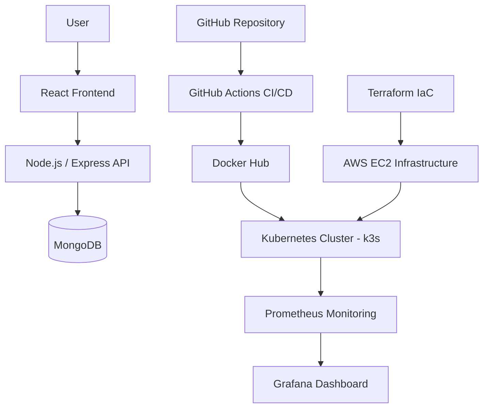

## GitHub Repository

Repository Link:
https://github.com/tahacansiz
## Project Overview

Bu proje, AWS altyapısı üzerinde production ortamına benzer bir DevOps/SRE sistemi oluşturmak amacıyla geliştirilmiştir. Projenin temel amacı; modern DevOps teknolojileri ve altyapı yönetim yaklaşımları kullanılarak cloud-native bir uygulama mimarisinin kurulması, otomasyonu, orkestrasyonu ve izlenebilirliğinin sağlanmasıdır.

Sistem, Kubernetes cluster’ı içerisinde yönetilen iki bağımsız workload’dan oluşmaktadır:

* MERN Stack uygulaması (React, Node.js, Express.js, MongoDB)
* Kubernetes CronJob yapısı üzerinde çalışan Python tabanlı ETL servisi

Proje kapsamında Infrastructure as Code (IaC) yaklaşımı benimsenmiş ve Terraform kullanılarak AWS üzerinde temel cloud kaynaklarının provisioning işlemleri gerçekleştirilmiştir. EC2 instance ve security group yapılandırmaları Terraform ile oluşturulmuş; Kubernetes cluster kurulumu, uygulama deployment süreçleri ve monitoring bileşenleri cloud ortamında yapılandırılmıştır.

Containerize edilen uygulamalar Kubernetes (k3s) ortamında deploy edilmiş ve GitHub Actions kullanılarak CI/CD süreçleri otomatikleştirilmiştir. Bu süreçte Docker image build işlemleri, Docker Hub’a push operasyonları ve Kubernetes deployment süreçleri pipeline üzerinden yönetilmiştir.

Sistemin gözlemlenebilirliğini artırmak amacıyla Kubernetes cluster’ına Prometheus ve Grafana tabanlı monitoring altyapısı entegre edilmiştir. Monitoring stack kurulumu sırasında resource bottleneck, memory pressure, high IO wait, pod instability ve service timeout problemleri gözlemlenmiş; Linux sistem araçları ve sistem optimizasyon yöntemleri kullanılarak troubleshooting süreçleri yürütülmüştür. Özellikle düşük kaynaklı cloud ortamında monitoring servislerinin davranışları analiz edilmiş, swap yönetimi ve resource optimizasyonu uygulanarak sistem stabilize edilmiştir.

Bu çalışma kapsamında aşağıdaki DevOps/SRE yetkinlikleri pratiğe dökülmüştür:

* Containerization ve orchestration
* CI/CD otomasyonu
* Infrastructure provisioning
* Monitoring ve observability
* Kubernetes workload yönetimi
* Cloud deployment süreçleri
* DevOps/SRE troubleshooting yaklaşımları

---

# Technologies Used

## Cloud & Infrastructure

* AWS EC2
* Terraform
* Linux (Ubuntu)

## Containerization & Orchestration

* Docker
* Kubernetes (k3s)
* Helm

## Backend & Frontend

* React
* Node.js
* Express.js
* MongoDB
* Python

## CI/CD

* GitHub Actions
* Docker Hub

## Monitoring & Observability

* Prometheus
* Grafana

---

# System Architecture

Sistem mimarisi AWS üzerinde çalışan Kubernetes tabanlı bir cloud-native yapıdan oluşmaktadır.

Frontend uygulaması React kullanılarak geliştirilmiş ve containerize edilerek Kubernetes cluster’ı içerisine deploy edilmiştir. Backend tarafında Node.js/Express.js tabanlı API servisi çalışmaktadır. Veri katmanı MongoDB ile sağlanmış ve Kubernetes içerisinde ayrı bir deployment olarak yönetilmiştir.

Python tabanlı ETL servisi Kubernetes CronJob yapısı ile belirli zaman aralıklarında çalışacak şekilde tasarlanmıştır. Bu yapı sayesinde belirlenen schedule doğrultusunda otomatik veri işleme süreçleri gerçekleştirilmektedir.

CI/CD süreçleri GitHub Actions üzerinden yönetilmektedir. Pipeline süreci Docker image build işlemleri, Docker Hub registry push operasyonları ve Kubernetes deployment güncellemelerini otomatik olarak gerçekleştirmektedir. Ayrıca path filtering yaklaşımı kullanılarak farklı workload’lar için bağımsız deployment süreçleri yönetilmiştir.

Infrastructure provisioning süreçlerinde Terraform kullanılarak AWS üzerinde temel cloud kaynakları oluşturulmuştur. EC2 instance ve security group yapılandırmaları Infrastructure as Code yaklaşımıyla provision edilmiş; Kubernetes cluster kurulumu ve uygulama deployment süreçleri cloud ortamında yönetilmiştir.

Bu yaklaşım sayesinde altyapı kaynaklarının daha yönetilebilir ve tekrar üretilebilir şekilde yapılandırılması amaçlanmıştır.

Monitoring ve observability ihtiyaçları için Prometheus ve Grafana cluster içerisine entegre edilmiştir. Sistem kaynakları, Kubernetes pod durumları ve servis sağlık kontrolleri monitoring altyapısı üzerinden izlenebilir hale getirilmiştir.

---

# Architecture Diagram



---

# Kubernetes Workloads

## MERN Stack Application

Kubernetes ortamında aşağıdaki workload bileşenleri oluşturulmuştur:

* Frontend Deployment
* Backend Deployment
* MongoDB Deployment
* Services
* Namespaces
* ConfigMaps
* Secrets

Frontend ve backend servisleri NodePort üzerinden dış erişime açılmıştır.

## Python ETL CronJob

Python tabanlı ETL servisi Kubernetes CronJob yapısı kullanılarak deploy edilmiştir.

Cron schedule:

```bash
0 * * * *
```

Bu yapı sayesinde ETL workload’u her saat başı otomatik olarak çalıştırılmaktadır.

---

# CI/CD Pipeline

CI/CD süreçleri GitHub Actions kullanılarak otomatikleştirilmiştir.

İki bağımsız workflow oluşturulmuştur:

* mern-deploy.yml
* python-etl.yml

Pipeline süreçleri:

1. Docker image build
2. Docker Hub push
3. SSH connection to EC2
4. Kubernetes rollout restart
5. Automated deployment

Ayrıca path filtering yaklaşımı kullanılarak sadece ilgili proje değişikliklerinde ilgili pipeline’ın çalışması sağlanmıştır.

---

# Infrastructure as Code (Terraform)

Terraform kullanılarak aşağıdaki AWS kaynakları oluşturulmuştur:

* EC2 Instance
* Security Groups

Terraform dosya yapısı:

```bash
provider.tf
main.tf
variables.tf
terraform.tfvars
outputs.tf
```

Infrastructure provisioning süreçleri Infrastructure as Code yaklaşımı ile yönetilmiştir.

---

# Configuration Management

Kubernetes ConfigMaps kullanılarak non-sensitive environment configuration yönetimi sağlanmıştır.

Kubernetes Secrets kullanılarak sensitive credential ve application configuration değerleri güvenli şekilde yönetilmiştir.

Ayrıca GitHub Actions Secrets kullanılarak CI/CD authentication süreçleri güvenli hale getirilmiştir.

Kullanılan Kubernetes configuration bileşenleri:

* backend-config
* frontend-config
* mongodb-config
* python-etl-config

Kullanılan Kubernetes secret bileşenleri:

* backend-secret
* mongodb-secret
* python-etl-secret

---

# Monitoring & Observability

Monitoring altyapısı için Prometheus ve Grafana tabanlı bir monitoring stack kurulumu gerçekleştirilmiştir.

Kurulumu gerçekleştirilen monitoring bileşenleri:

* Prometheus Server
* Alertmanager
* Node Exporter
* kube-state-metrics
* Grafana

Grafana servisi NodePort üzerinden dış erişime açılmıştır.

Monitoring altyapısı kapsamında Kubernetes pod durumları, resource kullanımı ve servis sağlık kontrollerinin izlenmesine yönelik çalışmalar gerçekleştirilmiştir.

Monitoring stack deployment sürecinde özellikle düşük kaynaklı cloud instance ortamında resource saturation ve memory pressure problemleri gözlemlenmiştir. Grafana dashboard erişimi sağlanmış olsa da Prometheus servisinde zaman zaman stabilite problemleri, timeout hataları ve readiness problemleri yaşanmıştır.

# Challenges & Troubleshooting

Monitoring stack kurulumu sırasında düşük kaynaklı(2gb ram) cloud instance üzerinde çeşitli resource problemleri gözlemlenmiştir.

Karşılaşılan problemler:

* Memory pressure
* High IO wait
* Prometheus readiness probe failures
* Pod instability
* Service timeout problemleri
* Connection reset problemleri

Troubleshooting sürecinde özellikle Memory Pressure kısmında zorlanıldı. Problemin çözümü için cloud instance disk kapasitesi 20GB seviyesine çıkarıldı ve ek olarak 4GB swap memory yapılandırması uygulandı. Swap alanı oluşturulduktan sonra Kubernetes node üzerindeki resource kullanımı optimize edilmiş ve sistem servislerinin daha stabil çalışması sağlanmıştır.


Monitoring stack deployment sürecinde Prometheus pod’u zaman zaman Running durumuna geçmesine rağmen monitoring bileşenlerinde stabilite problemleri gözlemlenmiştir. Özellikle düşük kaynaklı cloud instance üzerinde bazı monitoring servisleri `Unknown` durumuna geçmiş ve yüksek restart sayıları oluşmuştur.

Bu durum memory pressure ve resource saturation problemleri ile ilişkilendirilmiş; sistem resource analizi sonrasında swap memory yapılandırması uygulanarak monitoring servislerinin daha stabil çalışması sağlanmıştır. Fakat timeout problemleri ve resource yetersizliği nedeniyle Prometheus servisi stabil çalışamamış ve Grafana ile olan monitoring entegrasyonunda bağlantı problemleri gözlemlenmiştir.


---

# Deployment Steps

## Clone Repository

```bash
git clone <repository-url>
```

## Build Docker Images

```bash
docker build -t image-name .
```

## Push Docker Images

```bash
docker push image-name
```

## Apply Kubernetes Manifests

```bash
kubectl apply -f .
```

## Deploy Infrastructure with Terraform

```bash
terraform init
terraform apply
```

---

# Screenshots

Bu repository içerisinde sistemin cloud ortamında çalıştığını, Kubernetes workload’larının başarılı şekilde deploy edildiğini ve CI/CD süreçlerinin doğrulandığını gösteren ekran görüntüleri paylaşılmıştır.

---

## GitHub Actions Pipeline Success

MERN application deployment pipeline çıktısı.


---

## Python ETL Pipeline

Python ETL workload pipeline çıktısı.


---

## Kubernetes Pod List

Kubernetes cluster içerisinde çalışan workload’ların görüntüsü.


---

## Monitoring Namespace

Monitoring namespace altında çalışan monitoring servisleri.


---

## Grafana Dashboard

Grafana monitoring dashboard erişimi.


---

## Terraform Apply Output

Terraform kullanılarak AWS altyapısının provision edildiğini gösteren çıktı.


---

## MERN Application Running on Kubernetes

Cloud ortamında Kubernetes üzerinden deploy edilen MERN application görüntüsü. Frontend servisi NodePort üzerinden erişilebilir durumdadır ve backend `/healthcheck` endpoint’i başarılı şekilde response döndürmektedir.

Public Access (deployment sırasında kullanılan endpoint):

http://16.171.39.223:30080


---

## Create Record Page

Frontend üzerinden yeni kayıt oluşturma ekranı.


---

## Record List Page

MongoDB üzerinde tutulan kayıtların frontend arayüzünde listelendiği ekran.


---

## Edit Record Page

Frontend üzerinden kayıt güncelleme işlemi.


---

## Delete Record Action

Frontend üzerinden kayıt silme işlemi.


---

## Python ETL Logs

Kubernetes CronJob yapısı ile çalışan Python ETL workload’unun başarılı execution çıktısı.


---

## Resource Monitoring Outputs

Memory pressure ve resource saturation problemlerinin analiz edilmesi amacıyla kullanılan sistem resource çıktıları.


---

# Future Improvements

Gelecek geliştirmeler kapsamında aşağıdaki iyileştirmeler planlanabilir:

* Centralized logging stack (Loki / ELK)
* HTTPS & TLS configuration
* Kubernetes Ingress Controller optimization
* Automated testing integration
* Horizontal Pod Autoscaling (HPA)
* Production-grade monitoring & alerting rules
* Multi-node Kubernetes cluster architecture
* Advanced secret management solutions
